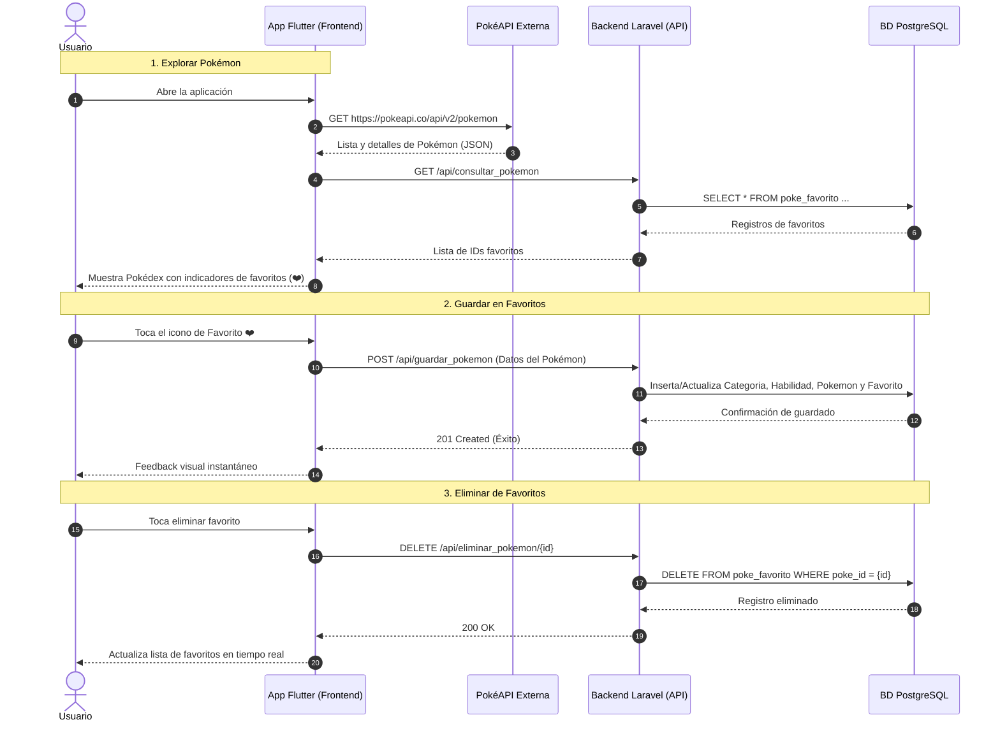
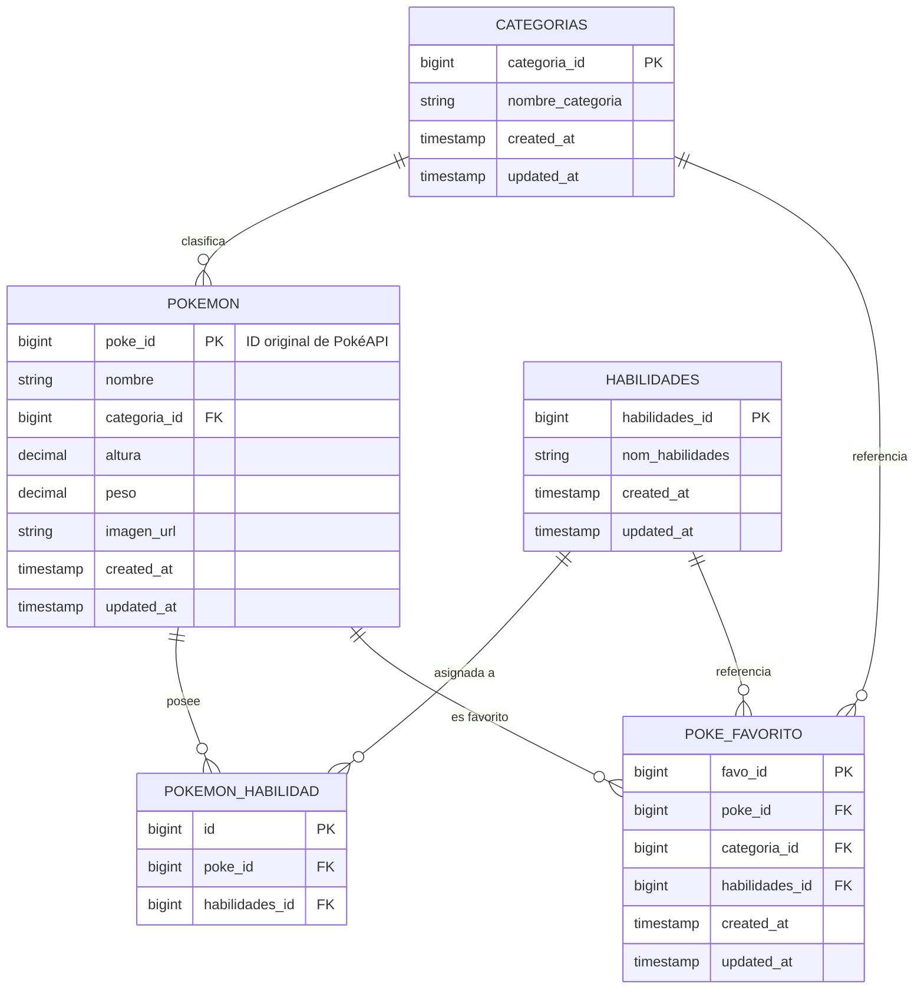

# 🏗️ Arquitectura del Sistema Pokémon

Este documento detalla la estructura, flujo de datos y modelo relacional del **Sistema Pokémon**.

---

## 🌟 Tecnologías Utilizadas

- **Frontend**: Flutter 3.x (Lenguaje Dart) - Multiplataforma (Web, Windows Desktop, Android, iOS).
- **Backend**: Laravel (PHP 8.2+) - API REST estructurada con Eloquent ORM.
- **Base de Datos**: PostgreSQL 16.
- **Containerización**: Docker & Docker Compose.
- **API Externa**: [PokéAPI](https://pokeapi.co/).
- **Control de Versiones**: Git (`main` y `staging`).

---

## 📁 Estructura de Directorios

```text
sistema_pokemon/
├── back/                           # Backend Laravel
│   ├── app/
│   │   ├── Http/Controllers/       # PokemonController.php (Lógica de endpoints)
│   │   └── Models/                 # Modelos Eloquent: Categoria, Habilidad, Pokemon, PokeFavorito
│   ├── database/migrations/        # Migraciones de PostgreSQL
│   ├── routes/api.php              # Definición de rutas REST
│   └── composer.json
│
├── front/                          # Frontend Flutter
│   ├── lib/
│   │   ├── models/                 # Modelos de datos (PokemonModel)
│   │   ├── screens/                # Pantallas (HomeScreen, FavoritesScreen, PokemonDetailScreen)
│   │   ├── services/               # Clientes HTTP (PokeApiService, BackendApiService)
│   │   ├── theme/                  # Colores por tipo y tema oscuro
│   │   ├── widgets/                # Componentes reutilizables (PokemonCard)
│   │   └── main.dart               # Punto de entrada de la aplicación
│   └── pubspec.yaml
│
├── docker/                         # Configuración de Docker
│   ├── Dockerfile                  # Imagen PHP con extensiones PostgreSQL
│   └── docker-compose.yml
│
├── documentacion/                  # Guías de arquitectura, API y despliegue
│   ├── arquitectura.md
│   ├── endpoints_api.md
│   └── guia_instalacion.md
│
├── docker-compose.yml              # Compose principal para levantar backend y BD
├── .gitignore                      # Reglas de exclusión para Git
└── README.md
```

---

## 🔄 Flujo de Datos



---

## 🗄️ Modelo Entidad-Relación de Base de Datos


